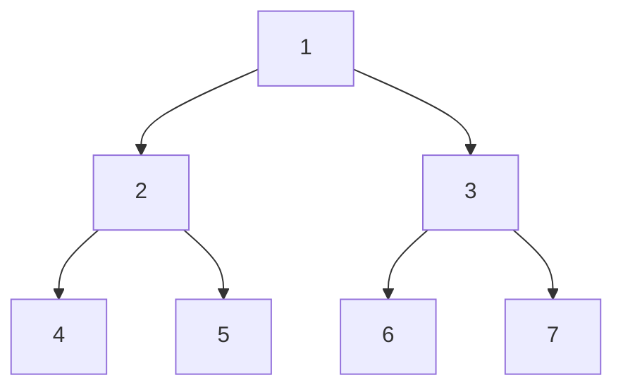

# Data Structures and Algorithms

### 1. Tree BFS Level Order Traveral 



```py
class Node:
    def __init__(self,data) -> None:
        self.data=data
        self.left=None
        self.right=None

root=Node(1)
root.left=Node(2)
root.right=Node(3)


root.left.left=Node(4)
root.left.right=Node(5)

root.right.left=Node(6)
root.right.right=Node(7)

"""
       1
     /   \
    2     3
  /  \   / \
 4   5   6  7
"""
if root !=None:
    print(root.data)

stack=[]
stack.append(root)
res=[]
res.append([root.data])
while len(stack)!=0:
  len_stack=len(stack)
  inter=[]
  for _ in range(len_stack):
    root=stack.pop(0)
    if root.left:
      stack.append(root.left)
      inter.append(root.left.data)
      #res.append(root.left.data)
    if root.right:
      stack.append(root.right)
      inter.append(root.right.data)
      #res.append(root.right.data)
  if len(inter)!=0:
    res.append(inter)
  inter=[]


  if root.left ==None and root.right==None:

    break
    
print(res)
print(res[::-1])

---


https://notion-avatar.vercel.app/api/img/eyJmYWNlIjoxLCJub3NlIjo1LCJtb3V0aCI6NiwiZXllcyI6MCwiZXllYnJvd3MiOjExLCJnbGFzc2VzIjoxMSwiaGFpciI6MTIsImFjY2Vzc29yaWVzIjowLCJkZXRhaWxzIjowLCJiZWFyZCI6MCwiZmxpcCI6MCwiY29sb3IiOiIjZmZmZmZmIiwic2hhcGUiOiJjaXJjbGUifQ==
